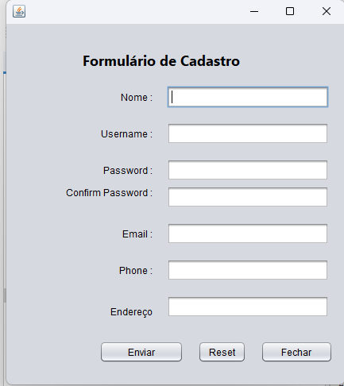
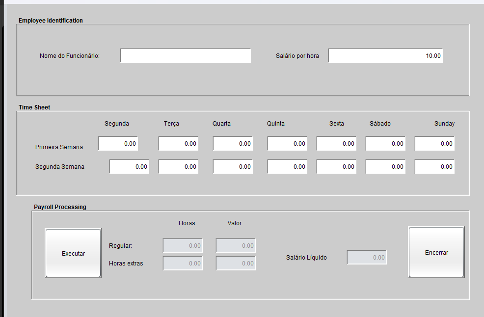
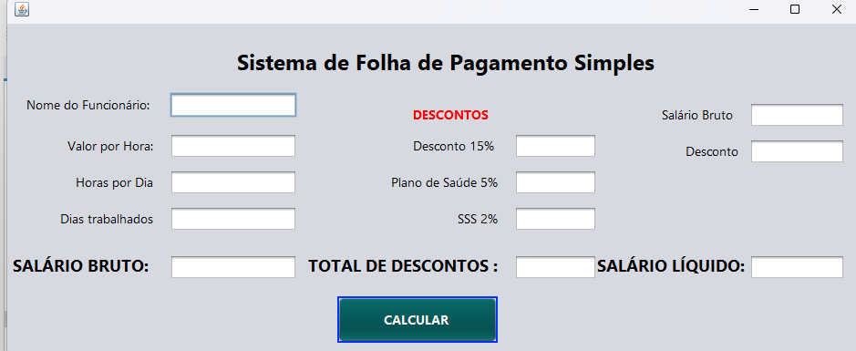

# 🧾 Sistema de Folha de Pagamento em Java

Este projeto é um sistema desenvolvido em Java com interface gráfica (Swing) para gerenciar a folha de pagamento de funcionários, permitindo cadastro, cálculo e controle de salários.

---

## 🛠 Funcionalidades

- Cadastro de funcionários
- Cálculo de salários e descontos
- Atualização de dados dos funcionários
- Exclusão de registros

---

## 💻 Tecnologias Utilizadas

- Java
- Swing para interface gráfica

---

## 📸 Imagens do Sistema

  
  
  


---

## 🚀 Como executar o projeto

1. Clone o repositório:
```bash
git clone https://github.com/Alineferk/folha-pagamento-java.git
cd folha-pagamento-java
